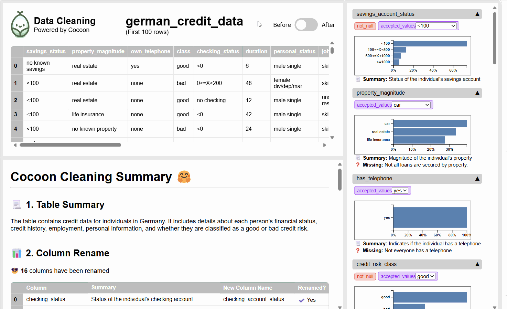

<div align="center">
  
</div>


😎 Cocoon organizes your data warehouse using LLM agents, preparing it for analysis. It connects to your data warehouses to explore and understand your data. It helps you interactively build, test, and maintain pipelines.
<kbd></kbd>

- 📚 We currently help you profile, clean and standardize your tables. [Learn more about current features](https://cocoon-data-transformation.github.io/page/)

- 👉 Check out the [demo](https://youtu.be/d9BIEGD7xok). Need support? Email: zh2408@columbia.edu


## Get Started

👉 [Try this Google Collab Notebook](https://colab.research.google.com/github/Cocoon-Data-Transformation/cocoon/blob/main/demo/fuzzy_join.ipynb)

Cocoon is available on PyPI:

```bash
pip install cocoon_data
```

To get started, you need to connect to
- LLMs (e.g., GPT-4, Claude-3, Gemini-Ultra...) 
- Data Warehouses (e.g., Snowflake, Duckdb...)

```python
from cocoon_data import *

# if you use Open AI, please ensure GPT-4 is available
openai.api_key  = 'xycabc'

# if you use Snowflake
con = snowflake.connector.connect(...)

query_widget, cocoon_workflow = create_cocoon_workflow(con)

# a helper widget to query your data warehouse
query_widget.display()

# the main panel to interact with Cocoon
cocoon_workflow.start_workflow()
```

🎉 You shall see the following on a notebook:

<kbd></kbd>
