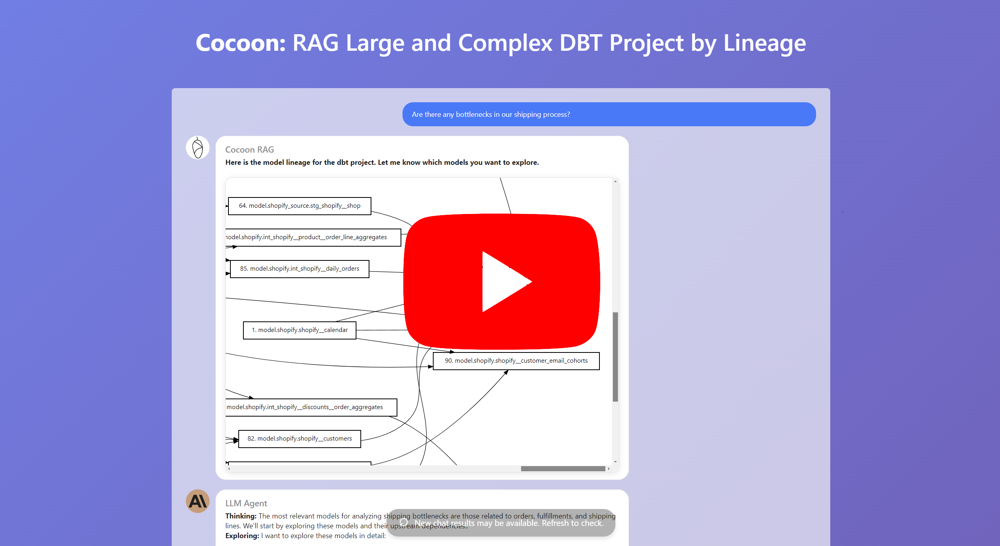
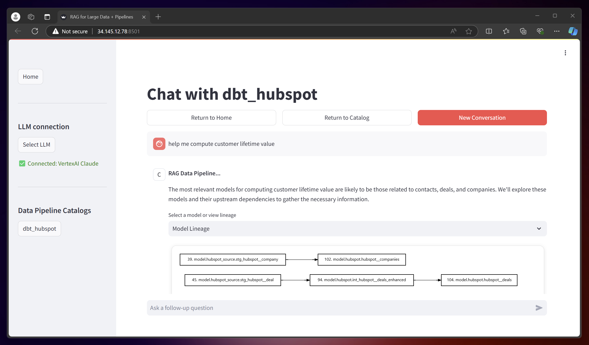

<div align="center">
  
</div>


Building a chatbot for your data and pipelines is challenging because they are often too large (e.g., 1,000+ tables) to fit within the LLM context window. Cocoon addresses this by creating a RAG layer for your data and pipelines. With Cocoon's RAG, we offer a cursor-style chatbot for your data tasks.


-  [*Live Demo for Data Pipeline RAG (Enter your question and we will generate response live)*](https://cocoon-data-transformation.github.io/page/pipeline)
  <br>
  <div align="center">
  <a href="https://youtu.be/kv5mwTkpfY0" target="_blank">
    
  </a>
  </div>
  <br>
  
-  [*Live Demo for Data Warehouse RAG (Enter your question and we will generate response live)*](https://cocoon-data-transformation.github.io/page/database)
  <br>
  <div align="center">
  <a href="https://youtu.be/xdmRXs0UnfE" target="_blank">
    
  </a>
  </div>
  <br>
  

- [*Learn more about all the features*](https://cocoon-data-transformation.github.io/page/)


## Get Started

- 👉 [Try this Google Collab Notebook for Data Warehouse RAG](https://colab.research.google.com/github/Cocoon-Data-Transformation/cocoon/blob/main/demo/Cocoon_Stage_Demo.ipynb)
- 👉 [Try this Google Collab Notebook for Data Pipeline RAG](https://colab.research.google.com/github/Cocoon-Data-Transformation/cocoon/blob/main/demo/Cocoon_RAG_pipeline.ipynb)

Cocoon is available on PyPI. Create a virtual env and then:

```bash
pip install cocoon_data -U
```

To get started, you need to connect to
- LLMs (e.g., GPT-4, Claude-3, Gemini-Ultra, or your local LLMs) 
- Data Warehouses (e.g., Snowflake, Big Query, Duckdb...)

```python
from cocoon_data import *

# if you use Open AI GPT-4
openai.api_key  = 'xycabc'

# if you use Snowflake
con = snowflake.connector.connect(...)

query_widget, cocoon_workflow = create_cocoon_workflow(con)

# a helper widget to query your data warehouse
query_widget.display()

# the main panel to interact with Cocoon
cocoon_workflow.start()
```

🎉 You shall see the following on a notebook:
<div align="center">
<kbd></kbd>
</div>


We also offer a browser UI, only for the chat over RAG feature. Simply:

```bash
pip install cocoon_data -U
cocoon_data
```

You shall see
<div align="center">
<kbd></kbd>
</div>
