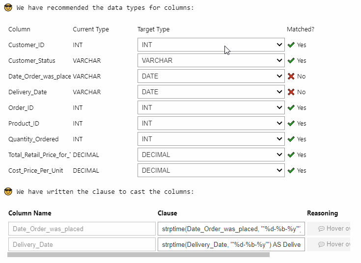
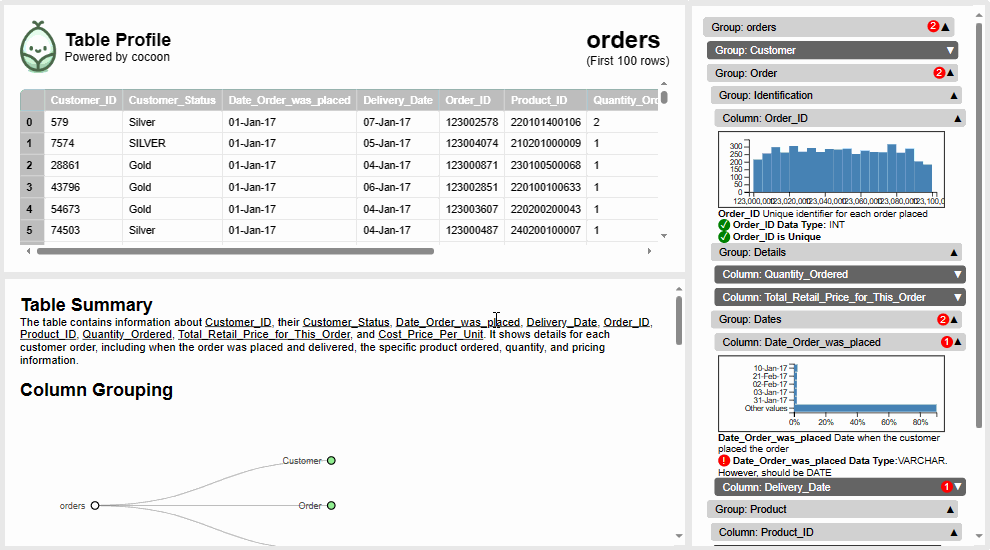
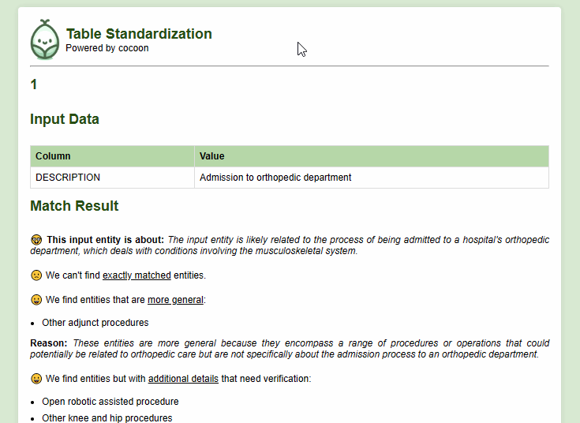

<div align="center">
  
</div>


😎 **Cocoon** provides LLM agents to organize your data warehouse, ready for analysis.


## Stage: Automatically suggest cleaning and generate DBT codes


- 👉 [**Python Package:** Check out the notebook that cleans tables in Snowflake/DuckDB](https://colab.research.google.com/github/Cocoon-Data-Transformation/cocoon/blob/main/demo/Cocoon_Stage_Demo.ipynb)
- 👉 Check out the [1 min demo](https://youtu.be/D7jw43ccOkg)

Screenshot where LLMs help you interactively cast columns and fix cases. The output is DBT staging sql/yml.

<kbd></kbd>


## Profile: Semantically understand your data and detect anomalies

Profiling is the first step to understanding the table and identifying any anomalies.

Many small decisions require semantic understanding by LLMs. For example, an age of 100 is acceptable, but -1 is impossible!

- 👉 [**Online Service:** Drop your CSV, and the profile will be ready in <10 min](https://cocoon-data-transformation.github.io/page/)
- 👉 [**Python Package:** Check out the notebook to interactively profile your table in python](https://colab.research.google.com/github/Cocoon-Data-Transformation/cocoon/blob/main/demo/Cocoon_Profile.ipynb)
- (Both run the same code; Python package requires LLM API, but is interactive and no size/#col limit)
  


<details>
  <summary>Check out more profiles</summary>
  
| Dataset Title                              | Profile Link |
|--------------------------------------------|--------------|
| AQI and Latitude/Longitude of Countries    | [View Profile](https://cocoon-data-transformation.github.io/page/profile_gallery/Cocoon_Profile_AQI_and_Lat_Long_of_Countries.html) |
| 2020 Property Sales Data                   | [View Profile](https://cocoon-data-transformation.github.io/page/profile_gallery/Cocoon_Profile__2020_property_sales_data.html) |
| AAC Shelter Cat Outcome                    | [View Profile](https://cocoon-data-transformation.github.io/page/profile_gallery/Cocoon_Profile_aac_shelter_cat_outcome_eng.html) |
| Books                                      | [View Profile](https://cocoon-data-transformation.github.io/page/profile_gallery/Cocoon_Profile_books.html) |
| Cancer                                     | [View Profile](https://cocoon-data-transformation.github.io/page/profile_gallery/Cocoon_Profile_cancer.html) |
| Divorces 2000-2015                         | [View Profile](https://cocoon-data-transformation.github.io/page/profile_gallery/Cocoon_Profile_divorces_2000_2015_original.html) |
| German Credit Data                         | [View Profile](https://cocoon-data-transformation.github.io/page/profile_gallery/Cocoon_Profile_german_credit_data.html) |
| K-Drama                                    | [View Profile](https://cocoon-data-transformation.github.io/page/profile_gallery/Cocoon_Profile_kdrama.html) |
| Patients                                   | [View Profile](https://cocoon-data-transformation.github.io/page/profile_gallery/Cocoon_Profile_patients.html) |
| Used Car Data                              | [View Profile](https://cocoon-data-transformation.github.io/page/profile_gallery/Cocoon_Profile_used_car_data_new.html) |

</details>

<details>
  <summary>Cite Cocoon Profile</summary>
  
```
@article{huang2024cocoon,
  title={Cocoon: Semantic Table Profiling Using Large Language Models},
  author={Huang, Zezhou and Wu, Eugene},
  journal={arXiv preprint arXiv:2404.12552},
  year={2024}
}
```

</details>


## (Preview) Fuzzy Join/Column Standardization/Entity Matching

Join could be challenging when a standardized join key is missing (e.g., join by non-standardized names).

We help you find the related ones, and explain how they are related.

- 👉 [**Python Package:** Check out the notebook](https://colab.research.google.com/github/Cocoon-Data-Transformation/cocoon/blob/main/demo/fuzzy_join.ipynb)

<kbd></kbd>

<details>
  <summary>Cite Cocoon Fuzzy Join</summary>
  
```
@article{huang2024disambiguate,
  title={Disambiguate Entity Matching through Relation Discovery with Large Language Models},
  author={Huang, Zezhou},
  journal={arXiv preprint arXiv:2403.17344},
  year={2024}
}
```

</details>

## Future

We are working on tools to help understand data, break silos and maintain pipelines for the data warehouse. 

These will make discovering tables, generating reports, and making predictions incredibly simple.

Email zh2408@columbia.edu to learn more...
