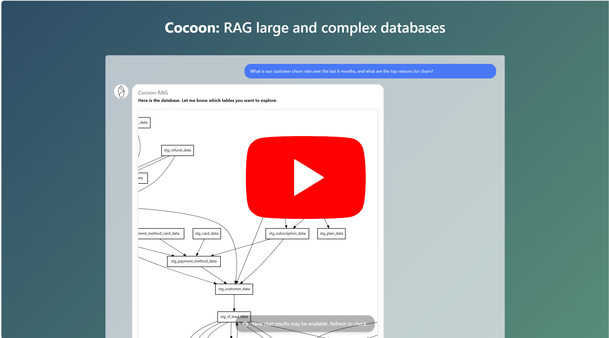
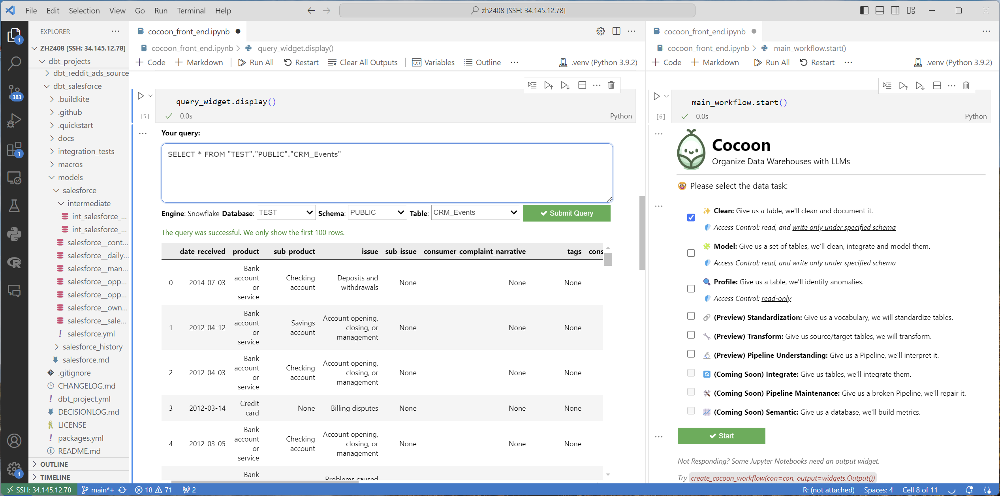

<div align="center">
  
</div>


😎 Cocoon organizes your data warehouse using LLM agents, preparing it for analysis. Specifically, Cocoon helps you with the tedious steps in data cleaning, data integration, and data modeling. As a result, you can focus on the more intellectual and business-critical parts. Check out the Youtube Deomo 👇: 

<br>
<div align="center">
<a href="https://youtu.be/xdmRXs0UnfE" target="_blank">
  
</a>
</div>
<br>

- 📚 [Learn more about features](https://cocoon-data-transformation.github.io/page/)
-  💪 Need support? Email: zh2408@columbia.edu


## Get Started

👉 [Try this Google Collab Notebook](https://colab.research.google.com/github/Cocoon-Data-Transformation/cocoon/blob/main/demo/Cocoon_Stage_Demo.ipynb)

Cocoon is available on PyPI:

```bash
pip install cocoon_data
```

To get started, you need to connect to
- LLMs (e.g., GPT-4, Claude-3, Gemini-Ultra, or your local LLMs) 
- Data Warehouses (e.g., Snowflake, Duckdb...)

```python
from cocoon_data import *

# if you use Open AI GPT-4
openai.api_key  = 'xycabc'

# if you use Snowflake
con = snowflake.connector.connect(...)

query_widget, cocoon_workflow = create_cocoon_workflow(con)

# a helper widget to query your data warehouse
query_widget.display()

# the main panel to interact with Cocoon
cocoon_workflow.start()
```

🎉 You shall see the following on a notebook:
<div align="center">
<kbd></kbd>
</div>
