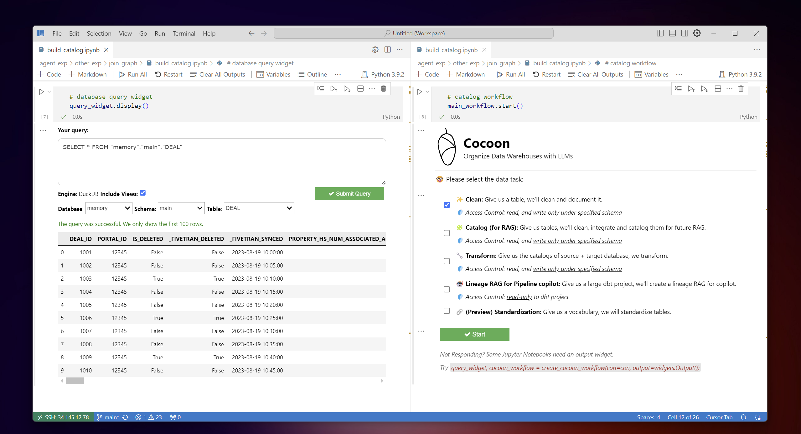

<div align="center">
  
</div>


Cocoon thoroughly prepares your data for RAG. Specifically, Cocoon helps document, connect, and optimize your data pipelines offline. The result can be used for online RAG in use cases like pipeline copilots and data transformation. Check out the YouTube demo 👇:

- 📚 [*Learn more about features*](https://cocoon-data-transformation.github.io/page/)
-  [*Demo for Data Warehouse RAG*](https://youtu.be/xdmRXs0UnfE)
  <br>
  <div align="center">
  <a href="https://youtu.be/xdmRXs0UnfE" target="_blank">
    
  </a>
  </div>
  <br>
  
-  [*Demo for Data Pipeline RAG*](https://youtu.be/kv5mwTkpfY0)
  <br>
  <div align="center">
  <a href="https://youtu.be/kv5mwTkpfY0" target="_blank">
    
  </a>
  </div>
  <br>


## Get Started

- 👉 [Try this Google Collab Notebook for Data Warehouse RAG](https://colab.research.google.com/github/Cocoon-Data-Transformation/cocoon/blob/main/demo/Cocoon_Stage_Demo.ipynb)
- 👉 [Try this Google Collab Notebook for Data Pipeline RAG](https://colab.research.google.com/github/Cocoon-Data-Transformation/cocoon/blob/main/demo/Cocoon_RAG_pipeline.ipynb)

Cocoon is available on PyPI:

```bash
pip install cocoon_data
```

To get started, you need to connect to
- LLMs (e.g., GPT-4, Claude-3, Gemini-Ultra, or your local LLMs) 
- Data Warehouses (e.g., Snowflake, Big Query, Duckdb...)

```python
from cocoon_data import *

# if you use Open AI GPT-4
openai.api_key  = 'xycabc'

# if you use Snowflake
con = snowflake.connector.connect(...)

query_widget, cocoon_workflow = create_cocoon_workflow(con)

# a helper widget to query your data warehouse
query_widget.display()

# the main panel to interact with Cocoon
cocoon_workflow.start()
```

🎉 You shall see the following on a notebook:
<div align="center">
<kbd></kbd>
</div>
