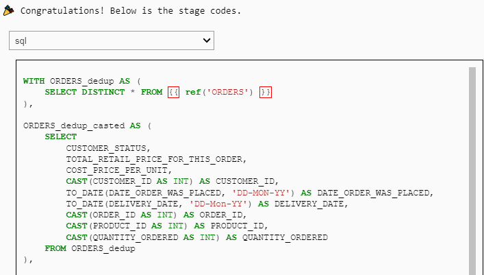

<div align="center">
  
</div>


😎 **Cocoon** uses LLMs to augment data engineering and data science.

## Profile: Semantically understand your data and detect anomalies


- 👉 [**Online Service:** Drop your CSV, and the profile will be ready in <10 min](https://cocoon-data-transformation.github.io/page/)
- 👉 [**Python Package:** Check out the notebook to interactively profile your table in python](https://colab.research.google.com/github/Cocoon-Data-Transformation/cocoon/blob/main/demo/Cocoon_Profile.ipynb)
- (Both run the same code; Python package requires LLM API, but is interactive and no size/#col limit)
  


<details>
  <summary>Check out more profiles</summary>
  
| Dataset Title                              | Profile Link |
|--------------------------------------------|--------------|
| AQI and Latitude/Longitude of Countries    | [View Profile](https://cocoon-data-transformation.github.io/page/profile_gallery/Cocoon_Profile_AQI_and_Lat_Long_of_Countries.html) |
| 2020 Property Sales Data                   | [View Profile](https://cocoon-data-transformation.github.io/page/profile_gallery/Cocoon_Profile__2020_property_sales_data.html) |
| AAC Shelter Cat Outcome                    | [View Profile](https://cocoon-data-transformation.github.io/page/profile_gallery/Cocoon_Profile_aac_shelter_cat_outcome_eng.html) |
| Books                                      | [View Profile](https://cocoon-data-transformation.github.io/page/profile_gallery/Cocoon_Profile_books.html) |
| Cancer                                     | [View Profile](https://cocoon-data-transformation.github.io/page/profile_gallery/Cocoon_Profile_cancer.html) |
| Divorces 2000-2015                         | [View Profile](https://cocoon-data-transformation.github.io/page/profile_gallery/Cocoon_Profile_divorces_2000_2015_original.html) |
| German Credit Data                         | [View Profile](https://cocoon-data-transformation.github.io/page/profile_gallery/Cocoon_Profile_german_credit_data.html) |
| K-Drama                                    | [View Profile](https://cocoon-data-transformation.github.io/page/profile_gallery/Cocoon_Profile_kdrama.html) |
| Patients                                   | [View Profile](https://cocoon-data-transformation.github.io/page/profile_gallery/Cocoon_Profile_patients.html) |
| Used Car Data                              | [View Profile](https://cocoon-data-transformation.github.io/page/profile_gallery/Cocoon_Profile_used_car_data_new.html) |

</details>

<details>
  <summary>Cite Cocoon Profile</summary>
  
```
@article{huang2024cocoon,
  title={Cocoon: Semantic Table Profiling Using Large Language Models},
  author={Huang, Zezhou and Wu, Eugene},
  journal={arXiv preprint arXiv:2404.12552},
  year={2024}
}
```

</details>


## (Preview) Stage: Automatically suggest cleaning and generate DBT codes

- 👉 [**Python Package:** Check out the notebook that cleans tables in Snowflake/DuckDB](https://colab.research.google.com/github/Cocoon-Data-Transformation/cocoon/blob/main/demo/Cocoon_Stage_Demo.ipynb)

- Interactively cast the column type and normalize cases

<kbd></kbd>

- The output is DBT staging sql/yml

<kbd></kbd>

## Future

We plan to support Data Cleaning, Data Integration, and Data Modeling.

👉 Check out the [3 min demo](https://www.youtube.com/watch?v=nddQ3jIdPCI)


